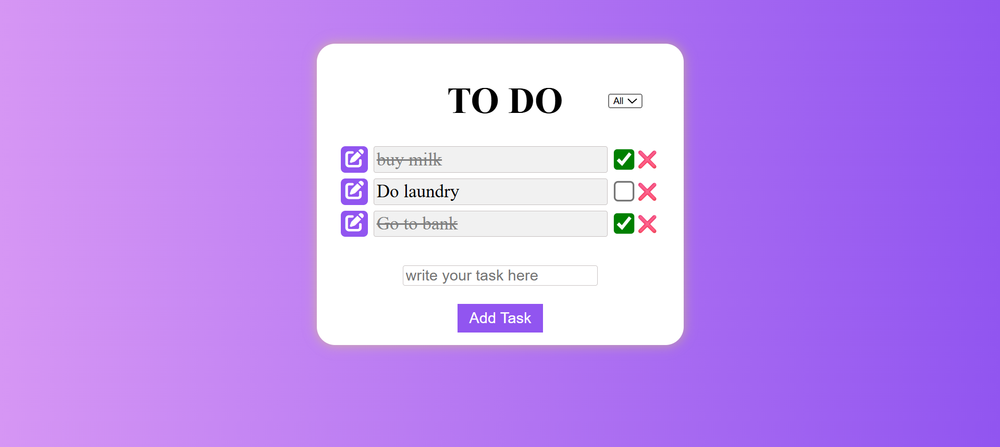
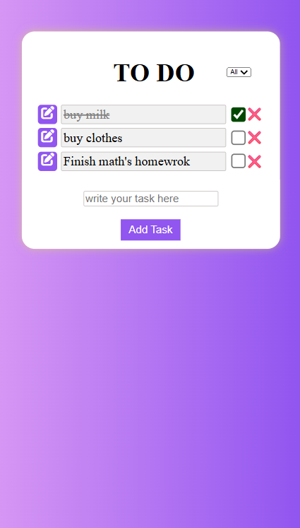

# ✅ To-Do List App  

[](https://github.com/rohan-chauhan101/TO-DO-APP/stargazers)
[](https://github.com/rohan-chauhan101/TO-DO-APP/network/members)
[](https://github.com/rohan-chauhan101/TO-DO-APP/issues)
[](./LICENSE)

A simple and interactive **To-Do List Application** built with **HTML, CSS, and JavaScript**.  
This project allows users to add, delete, and manage tasks dynamically with real-time updates.

---

## 🚀 Features

- ➕ **Add Tasks**: Enter tasks using the input field.  
- ❌ **Prevent Duplicates**: Duplicate task entries are automatically blocked.  
- ✅ **Mark Tasks as Complete**: Check off completed tasks using checkboxes.  
- 🗑 **Delete Tasks**: Remove tasks individually.  
- 📱 **Responsive UI**: Works across different screen sizes.  

---

## 🛠 Tech Stack

- **HTML5** → Structure of the app  
- **CSS3** → Styling (responsive and clean UI)  
- **JavaScript (Vanilla JS)** → Core logic (DOM Manipulation)  

---

## 📂 Project Structure

to-do-list-app/
│
├── index.html # Main HTML file
├── style.css # Styling file
├── script.js # Core JavaScript functionality
└── README.md # Project documentation


---

## 📸 Screenshots

### 🖥 Desktop View


### 📱 Mobile View


---

## ⚙️ Installation & Usage

1. **Clone the repository**
   ```bash
   git clone https://github.com/rohan-chauhan101/TO-DO-APP.git

    cd to-do-list-app

    open index.html

📌 **Future Improvements**

 ✨ Add Local Storage Support (save tasks even after reload).

 🌙 Implement Dark Mode.

 📅 Add Task Deadlines & Reminders.

 🔍 Add Search & Filter Options.


🤝 **Contributing**

Contributions are welcome!
If you'd like to improve this project:

1.Fork the repo

2.Create a new branch (feature/your-feature)

3.Commit your changes

4.Push the branch

5.Open a Pull Request

👨‍💻 **Author**

Rohan Chauhan
📧 [rohanchohan2580@gmail.com]
[GitHub Profile](https://github.com/rohan-chauhan101)